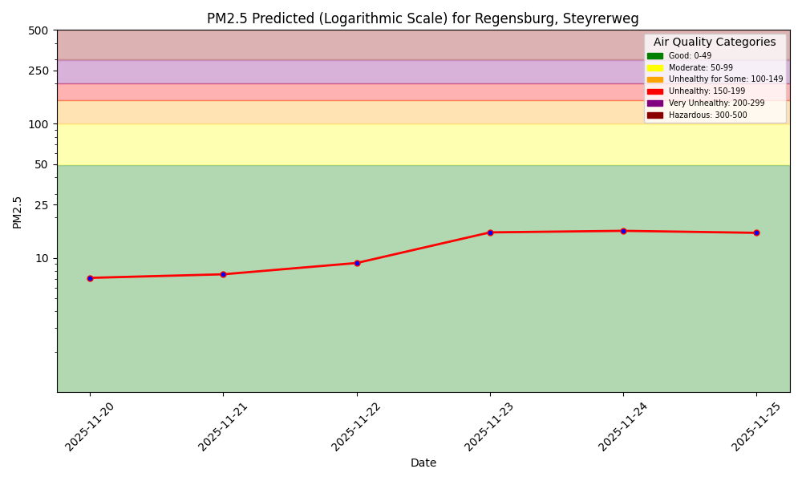
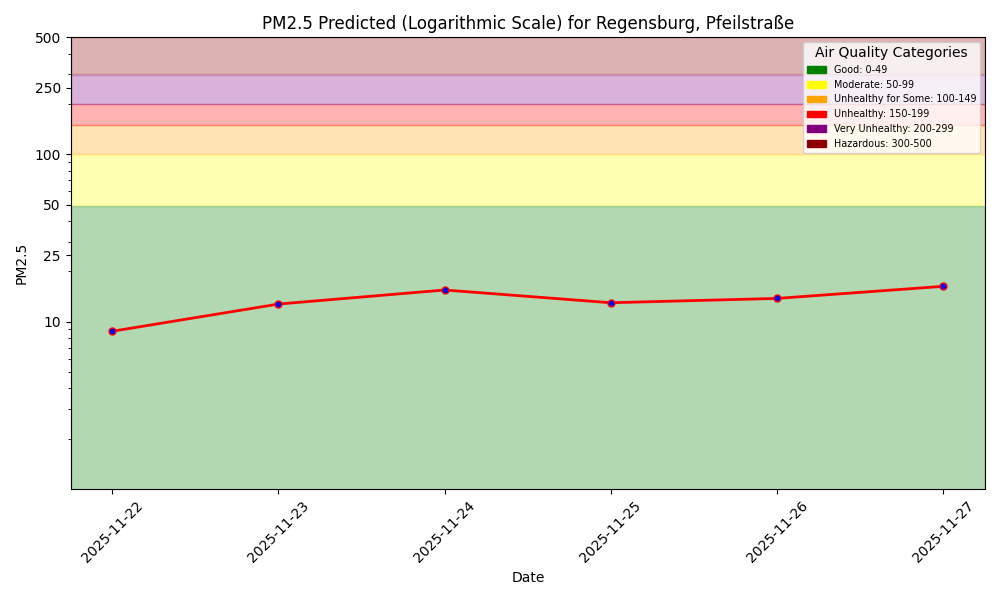
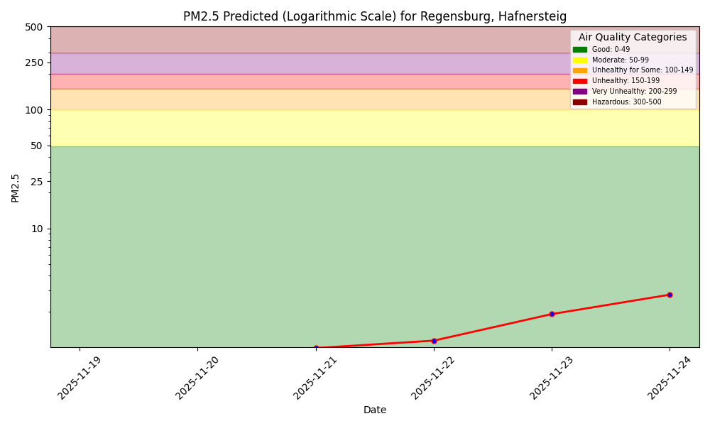
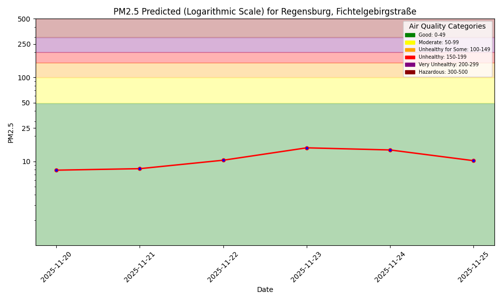
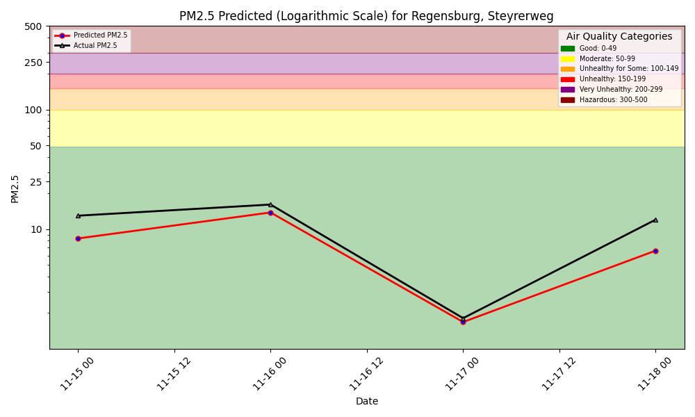
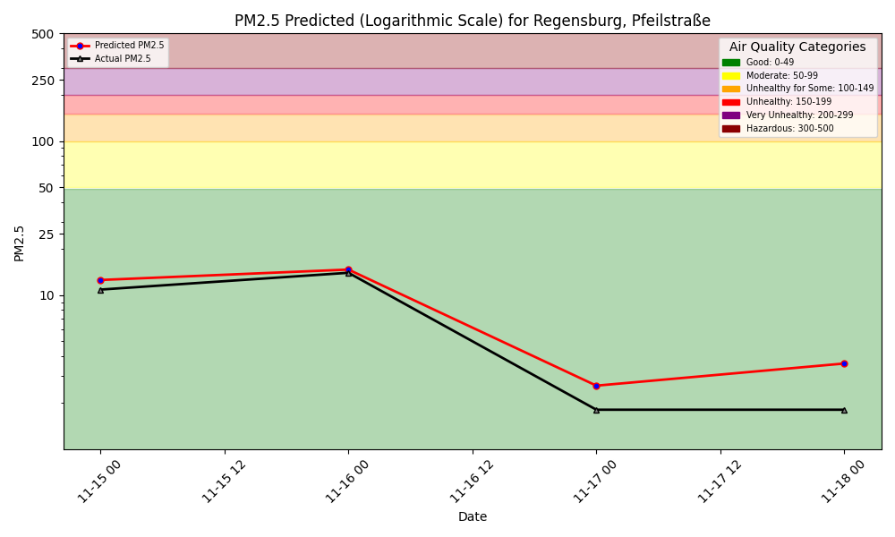
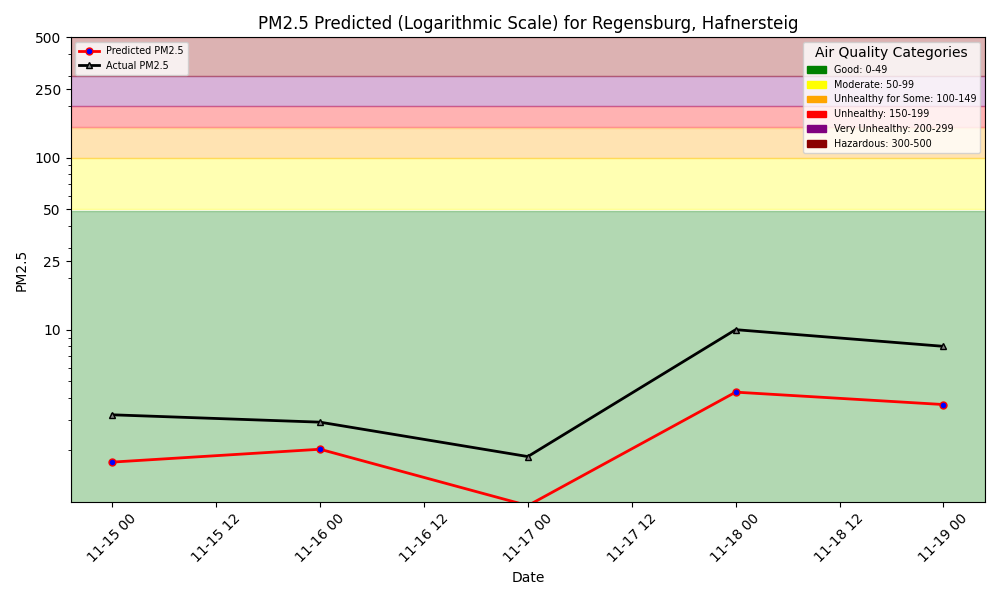
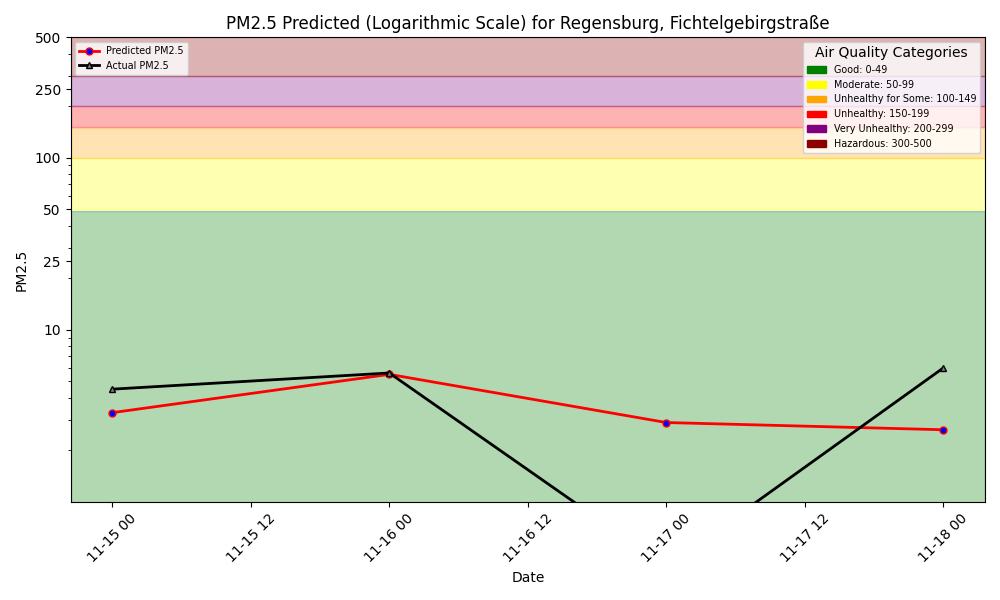

# Air Quality Dashboard



### 7-Day Forecasts

### Steyrerweg Forecast

### Pfeilstraße Forecast

### Hafnersteig Forecast

### Fichtelgebirgstraße Forecast

There is also a Python program to interact with the air quality ML system using language (text, voice),
powered by a [function-calling LLM](https://www.hopsworks.ai/dictionary/function-calling-with-llms).

---

# Model Performance Monitoring

1-Day Hindcast: Predictions vs Outcomes

### Steyrerweg Hindcast

### Pfeilstraße Hindcast

### Hafnersteig Hindcast

### Fichtelgebirgstraße Hindcast

